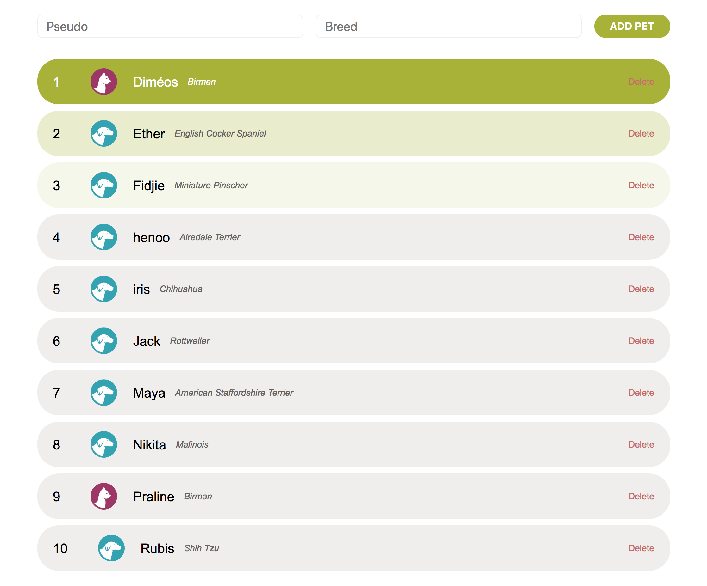

# YUMMYPETS INTERN TASK SPECIFICATION
Render a list of pets from Yummypets API

## Prerequisites
* We’ll check your work on the latest Chrome browser
* Use ES5 or ES6 (no need to transpile ES6 to ES5)
* Try to use immutable approaches to avoid side-effects (map, filter, slice methods)
* If you prefer you can use any JS framework or library, but be sure not to waste too much time on its installation (there’s no extra points for framework using) 
* While working commit each step to your git repository
* Don’t forget to comment on tricky parts of your code

## Task to accomplish
Your task is to fetch a list of pets from Yummypets API, display it and provide a set of actions that manipulate this list. 

We’re convinced that ‘less is more’ so try to write your code as simple as possible. If you feel that you’re stuck on one of the features, don’t get discouraged and move on to other steps. Your goal is to complete as many steps as possible, it’s ok if you don’t finish them all. 

We wish you good luck!

1. Init git project and work on ‘master’ branch.
2. Fetch a list of 10 pets from Yummypets API with AJAX or Fetch API. Use the following request: https://api.yummypets.com/pets and the parameter called “limit” to determine the number of pets (10).
3. Render the list in your view: display each entry index (that is not present in the object received from API), pet avatars, pseudos, breeds and delete buttons.
4. For each list entry provide a way to remove it from the list (from both the JS array and the screen).
5. Add a pet at the end of your list by using the form with two fields (‘pseudo’ and ‘breed’):
    1. Be sure the 2 form fields: ‘pseudo’ and ‘breed’ are filled.
    2. Each new pet has to have a unique id – integer that is greater than 500000 and less than 600000.
    3. Use this image url:  as an avatar for your new pet.
6. Add CSS to style your list. Inspire yourself by the screenshot we provide you with.
    1. Using CSS variables is a plus.
    2. No need to use browser prefixes.
    3. Use basic sans-serif font-family such as Arial or Helvetica.
    4. Colors:
        1. Green: #A8B32C
        2. Second list item: rgba(168, 179, 44, 0.25)
        3. Third list item: rgba(168, 179, 44, 0.1)
        4. Light grey: #EFEEED
        5. Delete button: #c86a6a
7. Create new git branch ‘dev’ from ‘master’ (if you can’t, continue on the master branch).
8. On ‘dev’ branch sort pseudos alphabetically from A to Z.

## Required skills to pass the test:
1. Git knowledge: creating a repository, pushing code to the repository, working with branches
2. JS knowledge: 
    1. Retrieving data from RESTful API by means of HTTP calls with parameters
    2. Selecting elements from within the DOM
    3. Creating elements dynamically
    4. Working with JS events such as ‘click’ and ‘submit’
    5. Working with different data structures: object, array
    6. Using functions and passing parameters
    7. Using JS and browser native methods: Math.random, loops, sort
    8. Using condition and combine condition expressions
3. CSS:
    1. Constructing basic CSS layout
    2. Centering items horizontally 
    3. Using CSS variables
    4. Using pseudo selectors
4. HTML
    1. Using semantic markup 
    2. Inserting external style and script sheets

